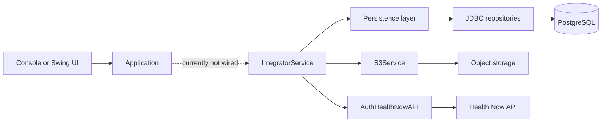

# Health Now Integrator Architecture

## Purpose

Health Now Integrator is a Java 8 desktop/console application intended to extract citizen data from PostgreSQL, prepare an integration file, upload that file to object storage, and authenticate with the Health Now API before sending the integration payload.

This document describes the architecture implemented in the repository as it exists today. It distinguishes implemented behavior from intended behavior where the code is incomplete.

## Architectural Style

The application uses a lightweight layered architecture with manual object construction and singleton factories. It does not use a dependency-injection framework or a web framework.

## Components

| Layer | Main classes | Responsibility | Current status |
| --- | --- | --- | --- |
| Bootstrap | `Application` | Selects the console or Swing entry point. | Implemented, but does not invoke the integration service. |
| Presentation | `ApplicationConsole`, `ApplicationSwing` | Collects database host and port from the console or opens a Swing window. | Skeleton only; neither screen configures or starts an integration. |
| Application service | `IntegratorService` | Coordinates data extraction, file generation, storage upload, and Health Now authentication. | Partially implemented; the generated file, upload, authentication token, and final delivery are placeholders. |
| API adapter | `ConnectionAPI`, `AuthHealthNowAPI` | Performs JSON HTTP requests and calls the Health Now authentication endpoint. | Generic HTTP handling is implemented; request/response contracts and configuration are incomplete. |
| Persistence | `ConnectionFactory`, `PersistenceFactory`, `AbstractJDBC`, `CidadaoJDBC` | Creates a PostgreSQL JDBC connection and reads citizens. | Basic read path is implemented; connection lifecycle needs improvement. |
| Domain model | `Cidadao`, `Localidade`, `Uf`, `Pais`, related classes | Represents citizens and geographic reference data. | Models exist; the repository currently maps only the citizen identifier. |
| Configuration and utilities | `DatabaseProperties`, `DatabaseModel`, `GsonUTCDateAdapter` | Holds database settings and serializes dates. | In-memory database configuration exists; required API properties are not present in the repository. |

## Runtime Flow

The intended integration flow in `IntegratorService.integrate()` is:

1. Obtain all citizens from `public.tb_cidadao` through `CidadaoJDBC`.
2. Generate a file from the retrieved citizens.
3. Upload the file through `S3Service` and retain its object key.
4. Authenticate with Health Now through `AuthHealthNowAPI`.
5. Send the resulting data to Health Now.

At present, only the query execution is functionally implemented. `generateCidadaoFile()` returns `null`; `S3Service.sendToBucket()` only logs messages and returns an empty key; `AuthRequest` and `AuthResponse` are empty; the authentication call receives an empty token; and the final data-delivery step is not implemented.

## Startup Behavior

`Application` starts `ApplicationSwing` when the first argument is `console`; otherwise, it starts `ApplicationConsole`. The argument name and selected UI are inverted relative to their apparent intent. Neither startup path initializes `DatabaseProperties` nor calls `IntegratorService.integrate()`.

## External Dependencies

| Dependency | Purpose | Notes |
| --- | --- | --- |
| Java 8 | Runtime and compilation target. | The project sets source and target compatibility to Java 8. |
| PostgreSQL JDBC 42.7.3 | Database connectivity. | Used by `ConnectionFactory`. |
| Gson 2.11.0 | JSON serialization and deserialization. | Used by `ConnectionAPI`. |
| Commons Logging 1.1.1 | Logging dependency. | No direct usage was found in the application source. |
| Maven Assembly Plugin | Builds a runnable jar with dependencies. | Manifest main class is `br.com.bancadoingresso.integrator.Application`. |

## Configuration

Database configuration is expected to be supplied by calling `DatabaseProperties.creatInstance(url, port, database, user, pwd)` before the first request for a JDBC connection. No current startup path performs this initialization.

`AuthHealthNowAPI` expects an `application.properties` resource with a `health-now-api-url` property. No such resource is currently present under `src/main/resources`, so constructing this API adapter will fail unless the resource is supplied externally.

Credentials must remain outside source control. Environment variables or an external, deployment-specific configuration file should be used to populate database, Health Now API, and object-storage settings.

## Data Access

`CidadaoJDBC.getAll()` uses a `PreparedStatement` and returns a list of `Cidadao` objects. It currently executes `SELECT * FROM public.tb_cidadao` and maps only `co_seq_cidadao`.

The JDBC connection is held in a static field and shared by repositories. This makes reconnection, concurrent execution, transaction boundaries, shutdown, and test isolation difficult. A production-ready implementation should acquire connections per operation or use a managed `DataSource`, and should close `Connection`, `PreparedStatement`, and `ResultSet` deterministically.

## HTTP Integration

`ConnectionAPI` uses `HttpURLConnection` and Gson to issue JSON requests. It supports GET, POST, PUT, DELETE, and PATCH through protected methods. The concrete Health Now adapter currently exposes only authentication at `/store/auth/v1`.

The current adapter has no explicit connect/read timeouts, retry strategy, response contract validation, or structured error type. These behaviors should be defined before a production integration is enabled.

## Cross-Cutting Concerns

### Error Handling and Observability

The service and persistence classes use `java.util.logging`. `ConnectionFactory` logs connection failures and terminates the JVM with `System.exit(-1)`, which prevents callers from recovering or presenting a contextual error. Exceptions should instead propagate through defined application boundaries and be logged with correlation information where applicable.

### Security

Database passwords are represented in `DatabaseModel`, and API authorization is passed as a plain string. Secrets must be injected from protected runtime configuration and must never be logged. HTTPS must be required for Health Now endpoints and object-storage communication.

### Testing

There is no `src/test` tree and no test dependency or test plugin configuration. Unit tests should cover file generation, HTTP request/response serialization, and configuration validation. Integration tests should exercise PostgreSQL access and failure handling against a non-production database.

## Recommended Evolution

The next implementation increments should preserve the existing Java 8 and Maven constraints while establishing these boundaries:

1. **Bootstrap configuration:** load and validate runtime configuration once, then construct the application dependencies explicitly.
2. **Use-case service:** keep `IntegratorService` as the orchestration point, but inject repository, file writer, object-storage client, and Health Now client dependencies.
3. **Infrastructure adapters:** keep JDBC, HTTP, and storage code behind focused interfaces so it can be tested independently from the integration workflow.
4. **Reliable processing:** define an idempotency key, transaction boundaries, retry policy, and a durable record of each integration attempt before processing production data.
5. **Operational readiness:** add timeouts, structured logs, health checks appropriate to the execution model, metrics, and an explicit shutdown path for database resources.

## Key Architectural Risks

- The advertised integration flow cannot complete because its file generation, storage, authentication contracts, and final delivery are unfinished.
- The required Health Now API properties resource is absent.
- Database initialization is not connected to either UI entry point.
- The static JDBC connection and `System.exit` behavior reduce resilience and testability.
- HTTP calls can block indefinitely because no timeouts are configured.
- No automated tests currently protect the integration workflow from regression.
